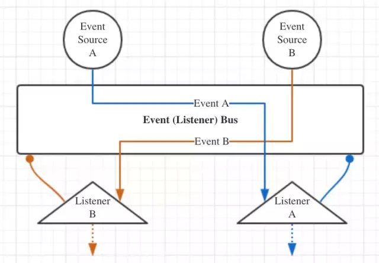
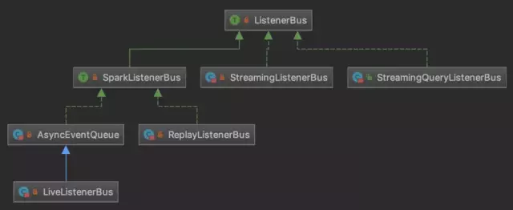

### LiveListenerBus事件总线

事件总线LiveListenerBus是Spark中非常重要的支撑组件，前面已经提到它采用了监听器的设计模式，其大致流程如下图：

ListenerBus特征是Spark内所有事件总线实现的基类，下图列出了它的一部分继承体系：

StreamingListenerBus和StreamingQueryListenerBus分别是Spark Streaming和Spark SQL的组件，这里主要看ListenerBus和SparkListenerBus这两个trait。
ListenerBus带有两个泛型参数L和E，其中L表示监听器类型，它可以是任意类型的引用，E表示的是事件类型。而其属性listenerPlusTimers则维护了所有注册在事件总线
上的监听器及对应计时器的二元元组，Option表示计时器是可选的，用来指示监听器处理事件的时间，采用并发容器CopyOnWriteArrayList支持并发的修改以保证线程安全。
而属性listeners根据代码可以看出，是将listenersPlusTimers中的监听器取出并转化为java中的List类型。

ListenerBus中还定义了一些与事件总线相关的方法，以下简单的说一下：
  * addListener() & removeListener()方法：分别向事件总线添加事件监听器和移除事件监听器，实现上很简单，就是在并发容器CopyOnWriteArrayList上执行add()
  方法和remove()方法。

  * doPostEvent()方法：将事件event投递给监听器listener进行处理，在此处只进行了抽象定义，具体逻辑在其实现类中。

  * postToAll()方法：通过doPostEvent()方法，将事件event投递给所有已经注册的监听器，由于它是线程不安全的，因此同时只能被一个线程调用。

SparkListenerBus这个trait是Spark Core内部事件总线的基类，继承于ListenerBus并实现了doPostEvent()方法来对事件进行匹配，并调用监听器的处理方法。如果无法
匹配到事件，则调用onOtherEvent()方法。它支持的监听器都是SparkListenerInterface的子类，事件则是SparkListenerEvent的子类。其中，SparkListenerInterface
定义了每个事件的处理方法，命名规则是"onXXX"，而SparkListenerEvent则是一个没有任何抽象方法的trait，它唯一的用途是以"SparkListener+事件名称"标记具体的事件
类。