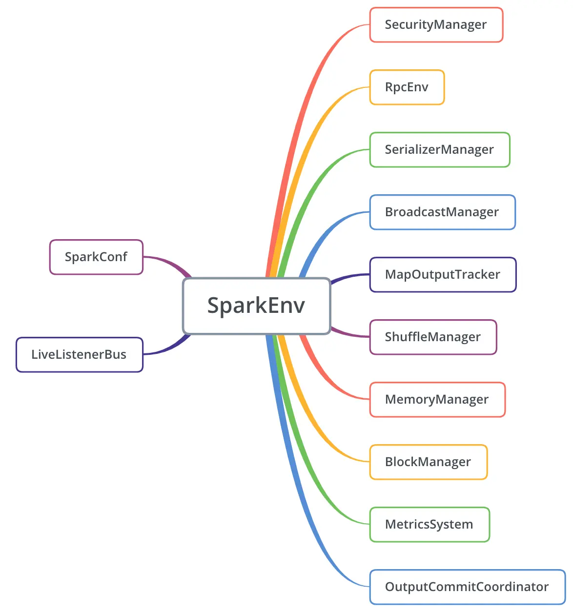

SparkEnv也是SparkContext中的重要组件，Driver和Executor的正常运行都离不开SparkEnv提供的环境，当SparkEnv初始化完成后，与Spark存储、计算、
监控相关的底层功能才真正准备好，可见其重要性。

在前面的源码研究过程中，我们已经知道Driver执行环境是通过调用SparkEnv.createDriverEnv()方法来创建的，这个方法在SparkEnv的伴生对象中。当然，
同理就会有createExecutorEnv()方法，它与createDriverEnv()方法类似，都是调用伴生对象内的create()方法来创建SparkEnv的，只是传递的方法略有
不同，其中executorId是Executor的唯一标识，如果是Driver的话，值是字符串的"driver"，bindAddress/advertiseAddress分别是监听socket绑定的
地址和RPC端点的地址，isLocal标识是否为本地模式启动，numUsableCores表示分配给Driver或Executor的CPU核数，ioEncryptionKey是I/O加密的密钥，
当spark.io.encryption.enable项启用时才会生效。

与SparkContext类似，SparkEnv中也涉及到了很多的组件：
  * SecurityManager：安全管理器，主要用于Spark安全控制，它负责通过共享密钥的方式进行认证，并基于ACL(访问控制列表)来管理Spark的账号和权限。

  * RpcEnv：即RPC环境，通过反射创建。Spark的各个实体间涉及大量的RPC通信，RpcEnv为RPC端点提供消息处理的环境，并进行端点的注册，端点间消息的
  路由即端点的销毁等。Spark目前的RPC底层是利用Netty实现的，NettyRpcEnv目前是其唯一的实现。

  * SerializerManager：序列化管理器，在大数据实时存储和数据处理中，经常需要对数据进行序列化和反序列化，有时甚至需要对数据进行压缩，
  SerializerManager就是负责进行序列化和反序列化等工作的组件。在SparkEnv.create()方法中，先通过instantiateClassFromConf()方法调用工具类
  Utils的classForName()方法，通过反射来创建类实例，序列化器的类型通过配置项spark.serializer指定，默认是org.apache.spark.serializer.JavaSerializer，
  我们日常比较经常用到的应该是KryoSerializer和AvroSerializer(在Flink中默认的序列化器是KryoSerializer和)，这里创建的序列化器是数据的序列化器，
  紧接着还创建了一个闭包的序列化器，在调度逻辑中(如DAGScheduler和TaskSetScheduler)会比较常用到，类型是JavaSerializer类型。

  * BroadcastManager：广播管理器，前面已经讲过，它为用户提供了在Executor之间共享数据的功能，此外在Spark内部也会用它来共享配置项或数据结构等。

  * MapOutputTracker：Map输出跟踪器，在shuffle的过程中，map任务通过shuffle write产生的中间数据在reduce任务进行reduce read时需要知道数据
  的存储节点信息，及map输出的状态信息，而这些信息就是由MapOutputTracker维护的，在代码实现上，根据当前节点是Driver还是Executor会进行不同的处理。
  在创建完MapOutputTracker后还会通过registerOrLookupEndpoint()方法注册(Driver节点)或查找(Executor节点)对应的RPC端点，并返回对其的引用。

  * ShuffleManager：即Shuffle管理器，负责shuffle阶段的管理并提供shuffle方法的实现，其种类通过spark.shuffle.manager设置，默认是sort表示
  SortShuffleManager，通过反射生成其实例对象。

  * MemoryManager：内存管理器，负责Spark节点内存的分配、使用与回收，主要涉及存储和执行两个方面，使用UnifiedMemoryManager进行统一管理，其默认
  会为系统预留300MB内存，其余留给存储和执行用。

  * BlockManager：块管理器，负责管理块的存储、读写和状态信息，是整个Spark存储子系统的基础，块是Spark内部数据的基本单位，但此"块"与操作系统中
  的"块"以及HDFS中的"块"并不是同一个概念，它既能存在于堆内内存，也可以存在于堆外内存和磁盘中，是Spark数据的通用表示方式。在初始化它之前，还需要
  先初始化BlockManager的主节点BlockManagerMaster和块传输服务BlockTransferService。BlockManager也是主从架构，Driver节点上的是主RPC端点
  BlockManagerMasterEndpoint，而各个Executor上的是从RPC端点BlockManagerSlaveEndpoint。

  * MetricsSystem：监控度量系统，是Spark监控体系的后端部分，负责收集与输出监控度量信息(即监控指标)，由系统实例Instance、数据源source、输出
  sink三部分组成。在Driver端初始化时需要依赖于TaskScheduler初始化后生成的Application ID，故不会马上启动。在Executor端初始化时由于Executor ID
  已存在故可立即启动。

  * OutputCommitCoordinator：输出提交协调器，若要将Spark作业的输出数据持久化到HDFS等外部存储，就需要从它来判断作业的每个Stage是否有权限提交，
  Driver上还注册了其RPC端点OutputCommitCoordinatorEndpoint，各个Executor会通过其引用访问它。

在create()方法的最后生成了SparkEnv类的实例，并创建了Driver端的临时文件夹，和返回该实例。与SparkContext一样，SparkEnv也会在伴生对象中将已创建的
SparkEnv的实例保存起来，一是避免重复创建，同时也是为了保证在同一节点上执行环境的一致性。还是用一张图来总结一下上面的内容：

