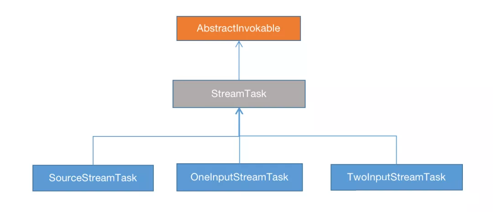

StreamTask
-------------

在[Flink源码阅读3：StreamOperator](./Flink源码阅读3-StreamOperator/)中已经说到StreamOperator上层是由StreamTask调用的，在Flink中将StreamTask称之为
Invokable，它是一个抽象类，是所有流式工作任务的基类。

StreamTask的层级结构如下图：

 

AbstractInvokable是一个抽象类，代表最顶层的Invokable，它是所有能够被TaskManager执行的task的抽象基类，流式任务和批处理任务都实现了该类，在这个
抽象类里面声明了最重要的方法invoke，可以认为其是task执行的起点，当执行一个task时，TaskManager会调用invoke方法，并且task所有的操作包括启动输入
输出的读写流等都发生在这个方法；此外还声明了与checkpoint相关的triggerCheckpointAsync/triggerCheckpointOnBarrier/abortCheckpointOnBarrier
/notifyCheckpointCompleteAsync方法；

StreamTask是AbstractInvokable的基本抽象实现类，实现了invoke、triggerCheckpoint等方法，另外声明了init、run等StreamTask生命周期的抽象方法，其
具体实现类有：
  * SourceStreamTask代表源(StreamSource)的Invokable;
  * OneInputStreamTask代表有一个输入流的Invokable;
  * TwoInputStreamTask代表有两个输入流的Invokable;

当然，还有其它关于批处理(BatchTask)、迭代流(StreamIterationHead/StreamIterationTail)等相关的Invokable。

StreamTask是一个基础的Invokable，它会去调用一个或是多个StreamOperators，前提是这些StreamOperators组成了一个operator chain，被chain在一起的
operator在一个线程内被同步的执行并且因此运行在同一个数据分区。在invoke方法内会调用这个operator的生命周期方法，invoke方法的执行可以分成以下步骤：
  * 基本的初始化工作：创建基础工具(如配置等)并且加载operators chain;
  * StreamTask的初始化，包括与checkpoint相关的例如Statebackend的创建，并最终调用operator的setup方法。调用task特定的init方法，当然具体实现
  是在其实现类里，主要完成StreamTwoInputProcessor的初始化来进行读取数据相关的处理;
  * StreamOperator的初始化：进行operator的状态的初始化，包括调用initializeState、openAllOperators方法，initializeState会调用到StreamOperator
  的initializeState方法，完成状态的初始化过程，openAllOperators方法会调用StreamOperator的open方法，调用与用户相关的初始化过程;
  * 执行过程：主要就是调用run()方法，具体的实现也是在对应的实现类里面，对于SourceStreamTask就是生产数据，对于OneInputStreamTask/TwoInputStreamTask
  主要就是执行读取数据与之后的数据处理流程，这个在正常情况下会一直执行下去
  * 资源释放：任务正常结束或是异常停止都会执行的操作，包括closeAllOperators、disposeAllOperators、cleanup等，我们在userFunction里面涉及到的
  资源链接一定要在close里面执行资源的释放

在StreamTask里面除了invoke方法的实现，还有checkpoint的相关实现方法triggerCheckpointAsync/triggerCheckpoint/triggerCheckpointOnBarrier
/abortCheckpointOnBarrier/notifyCheckpointCompleteAsync等。

另外，StreamTask实现了AsyncExceptionHandler接口，这个接口内包含了一个handleAsyncException方法，该方法在StreamTask的实现是使当前的StreamTask
失败，在Flink里面，窗口定时触发或者是ProcessFunction的onTimer方法等相对于上面提到的run方法是一个异步过程，也就是说是由其它线程来执行的，如果这个异
步执行的线程抛出的异常我们希望主线程也能捕获到并进行相应的处理，那么AsyncExceptionHandler就是完成这个功能的。

StreamTask中通过getCheckpointLock获取锁对象，定时调用与checkpoint执行都会使用这个lock对象完成同步功能，保证数据的一致性。比如在定时调用onTimer
方法内可能会涉及到对状态的操作，但是处理方法processElement里面也会对状态进行操作，状态对于这两个线程是共享资源，如果不使用锁进行同步可能会导致状态数据
的不一致。