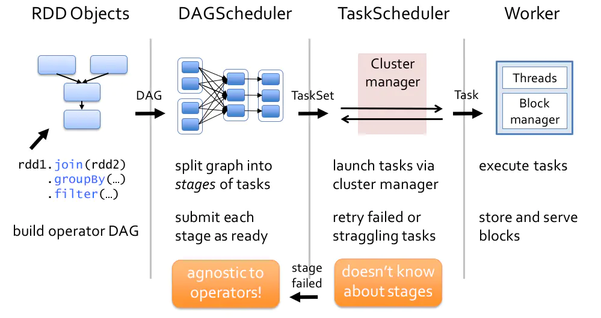

在[Spark源码阅读31：Stage的提交](/Spark源码阅读31-Stage的提交/)已经说到，最终stage被封装成TaskSet，并使用taskScheduler.submitTasks进行提交。TaskScheduler负责
低层次任务的调度，每个TaskScheduler为一个特定的SparkContext调度tasks。这些调度器获取到由DAGScheduler为每个stage提交至他们的一组Tasks，并负责将这些tasks
发送到集群，以执行它们，在它们失败时重试，并减轻掉队情况。Tasks是Task的集合，而submitTasks方法就定义在TaskScheduler Trait当中。Trait是scala中的概念(前面已经多次出现过)，
如果没有scala的开发经验，可以大致将其类比于Java中的接口。目前，TaskScheduler最主要的实现是TaskSchedulerImpl。

阅读TaskScheduler的源码，可知它主要提供了实力化和销毁时必须的start()和stop()方法，以及提交和取消Tasks的的submitTasks()方法与cancelTasks()方法，并且通过
executorHeartbeatReceived()方法周期性的接收executor的心跳，更新运行中的tasks的元信息，并通知master告知BlockManager仍然存活。

接下来看一下TaskScheduler最主要的实现类TaskSchedulerImpl的submitTasks()方法，它首先获取到了TaskSet中的tasks，然后使用synchronized进行同步。在同步代码块中，首先创建了TaskSetManager。
从名字就可以看出，TaskSetManager是TaskSet的管理者，主要在TaskSchedulerImpl中调度同一个TaskSet中的tasks，它追踪每一个task，当他们失败时进行重试，直到限制的最大次数，
并通过延迟调度来处理位置感知的调度。它最主要的接口就是resourceOffer()方法，该方法询问TaskSet是否想要在一个节点上运行一个task，并且当task的状态发生变化通知它时
handleSuccessfulTask/handleFailedTask。

在TaskSetManager创建完成后，获取到TaskSet对应的stageId，更新数据结构taskSetsByStageIdAndAttempt，将映射关系stageId->[taskSet.stageAttemptId->TaskSetManager]存入，这里的TaskSetManager
就是上面创建的TaskSetManager。而stageAttemptId是在DAGScheduler的submitMissingTasks()方法中调用taskScheduler.submitTasks()方法时构造TaskSet对象时通过stage.lastInfo.attemptId传入的，
stage.lastInfo返回的是该stage的最新尝试attempt的StageInfo。而StageInfo是通过stage和nextAttemptId共同构造的，nextAttemptId初值为0，并在makeNewStageAttempt()方法中进行自增，submitMissingTasks()
中会调用makeNewStageAttempt()方法，而submitMissingTasks()是真正提交stage的方法，也就是说每次提交stage时，都会调用方法并对nextAttemptId进行自增。

将所有属于该stage的TaskSetManagers标记为僵尸状态，并将TaskSetManager添加到schedulableBuilder中，schedulableBuilder是调度构造器，其实是一个调度构造树的接口，提供了一个成员变量Pool类型的rootPool和两个
主要方法：buildPools()方法构造调度树节点、addTaskSetManager()方法构造叶子节点。在TaskSchedulerImpl.initialize()方法中可以看到有两种不同类型的调度构造器(NONE不算)，分别是FIFO和FAIR。
以FIFOSchedulableBuilder为例，其buildPools()方法是一个空方法，什么都没做，而buildPools()方法就是调用Pool的addSchedulable()方法，在其中主要是将schedulable加入到ConcurrentLinkedQueue类型的
schedulableQueue队列，将schedulable的name和schedulable的对应关系添加到ConcurrentHashMap类型schedulableNameToSchedulable集合，将this赋值给schedulable的parent，形成schedulable为this子节点的
树形结构。TaskSetManager也实现了Schedulable这个trait，因此也是可以被调度的。

最后调用SchedulerBackend的reviveOffers()。SchedulerBackend是Spark的一个可插拔的组件，有多种实现方式，主要作用是在物理机或worker就绪后，能够提供其上的资源并将tasks加载到那些机器或worker上。它也是在
TaskSchedulerImpl.initialize()中进行初始化的，但值SchedulerBackend类型的backend的值则要追溯到TaskSchedulerImpl实例化的时候了，那是在SparkContext中，根据Spark的部署模式来确定创建何种TaskScheduler及
SchedulerBackend。以Standalone说明，TaskScheduler的实现是TaskSchedulerImpl，而SchedulerBackend的实现是StandaloneSchedulerBackend，并调用initialize()方法完成了初始化。reviveOffers()是在
CoarseGrainedSchedulerBackend调用的，其调用了driverEndpoint的send()方法，发送一个ReviveOffers消息。而driverEndpoint是RPC中driver端Endpoint的引用，类型是RpcEndpointRef。它通过rpcEnv.setupEndpoint()
赋值，rpcEnv是一个abstract class，其实现是NettyRpcEnv，在其setupEndpoint()方法中，主要是调用dispatcher.registerRpcEndpoint()进行注册，并最终由它向上返回NettyRpcEndpointRef完成赋值。返回的RpcEndpointRef
为NettyRpcEndpointRef类型，而RpcEndpointRef则是一个远程RpcEndpoint的引用，通过它可以给远程RpcEndpoint发送消息，可以是同步可以是异步，它映射一个地址。由此可见，我们在远端注册了一个RpcEndpoint，
即DriverEndpoint，而在本地端则持有一个RpcEndpoint的引用，即NettyRpcEndpointRef，可以由它来往远端发送消息，那么发送的是什么消息呢？返回CoarseGrainedSchedulerBackend中的reviveOffers()方法，发现
发送的是ReviveOffers消息。这里只是发送，具体处理还要看远端的RpcEndpoint，即DriverEndpoint。通过上面我们可以知道，RpcEndpoint的服务流程为onStart()-->receive()--> onStop()。

每当消息来临时，DriverEndpoint都会调用receive()方法来处理，在其中可以看到其判断是否ReviveOffers事件，若是则调用makeOffers()方法处理，而在makeOffers()方法中，其向所有的executors提供了抽象的资源，
包括resourceOffers()分配资源，launchTasks()启动tasks。代码逻辑上看：它先从executorDataMap中过滤掉under killing的executors，得到activeExecutors；然后利用activeExecutors中executorData的
executorHost、freeCores，获取workOffers，即资源；最后，调用scheduler的resourceOffers()方法，分配资源，并调用launchTasks()方法，启动tasks：这个scheduler就是TaskSchedulerImp。

executorDataMap是CoarseGrainedSchedulerBackend掌握的集群中executor的数据集合，key为String类型的executorId，value为ExecutorData类型的executor详细信息。ExecutorData包含的主要内容如下：
  * executorEndpoint：RpcEndpointRef类型，RPC终端的引用，用于数据通信;

  * executorAddress：RpcAddress类型，RPC地址，用于数据通信;

  * executorHost：String类型，executor的主机;

  * freeCores：int类型，可用处理器cores;

  * totalCores：int类型，处理器cores总数;

  * logUrlMap：Map[String, String]类型，日志url映射集合;

  * attributes：Map[String, String]类型，属性值;

  * resourcesInfo：Map[String, String]类型，executor上当前可用资源的信息;

通过以上信息我们就能知道集群当前executor的负载情况，方便资源分析并调度任务。

那么executorDataMap内的数据是何时及如何更新的呢？对于第一步中，过滤掉under killing的executors，其实现是对executorDataMap中的所有executor调用executorIsAlive()方法中，判断是否在
executorsPendingToRemove和executorsPendingLossReason两个数据结构中，这两个数据结构中的executors都是即将移除或者已丢失的executor。
在过滤掉已失效或者马上要失效的executor后，利用activeExecutors中executorData的executorHost、freeCores，构造workOffers，即资源，这个workOffers更简单，是一个WorkerOffer对象，它代表了系统的可利用资源。

在最重要的第三步，先是调用scheduler.resourceOffers(workOffers)，即TaskSchedulerImpl的resourceOffers()方法，然后再调用launchTasks()方法将tasks加载到executor上去执行。

在TaskSchedulerImpl的resourceOffers()方法中，主体流程如下：
1、设置标志位newExecAvail为false，这个标志位是在新的slave被添加时被设置的一个标志，下面在计算任务的本地性规则时会用到;

2、循环offers，WorkerOffer为包含executorId、host、cores、address的结构体，代表集群中的可用executor资源;
2.1、如果有新的slave，则更新hostToExecutors，hostToExecutors为利用HashMap存储的host->executorIds映射的集合;
2.2、如果有新的executor;
2.3.1、hostToExecutors中添加一条记录，key为host，value为new HashSet[String]()；
2.3.2、发送一个ExecutorAdded事件，并由DAGScheduler的handleExecutorAdded()方法处理；
2.3.3、更新executorIdToHost;
2.3.4、更新executorIdToRunningTaskIds;
2.3.5、标志位newExecAvail设置为true;
2.4、更新hostsByRack；
总结起来说，就是对集群中的可用executor资源offers的循环处理，更新一些数据结构，并且，在新的host加入时，标志位newExecAvail设置为true，并且发送一个ExecutorAdded事件，交由DAGScheduler的handleExecutorAdded()方法处理。
在handleExecutorAdded()方法中，先将对应host从failedEpoch中移除，failedEpoch存储的是系统探测到的失效节点的集合，存储的是execId->host的对应关系。
接下来便是调用submitWaitingStages()方法提交等待的stages。

3、随机shuffle offers（集群中可用executor资源）以避免总是把任务放在同一组workers上执行，是为了避免热点问题而采取的一种随机策略;

4、构造一个task列表，以分配到每个worker，针对每个executor按照其上的cores数目构造一个cores数目大小的ArrayBuffer，实现最大程度并行化;

5、获取可以使用的cpu资源availableCpus;

6、获取可以使用的Slot资源availableSlots;

7、调用rootPool.getSortedTaskSetQueue()方法获得排序好的task集合，即sortedTaskSets;
首先，创建一个ArrayBuffer，用来存储TaskSetManager，然后对Pool中已经存储好的TaskSetManager，即schedulableQueue队列，按照taskSetSchedulingAlgorithm
调度规则或算法来排序(包括FIFO和Fair两种)，得到sortedSchedulableQueue，并循环其内的TaskSetManager，通过其getSortedTaskSetQueue()方法来填充sortedTaskSetQueue，
最后返回。TaskSetManager的getSortedTaskSetQueue()方法也很简单，追加ArrayBuffer[TaskSetManager]即可。

先分析FIFO调度策略，代码在SchedulingAlgorithm.scala中，逻辑上很简单，就是先比较两个TaskSetManager的优先级priority，优先级相同再比较stageId，而priority在
TaskSet生成时确定，就是jobId，也就是FIFO是先按照Job的顺序再按照Stage的顺序进行顺序调度，一个Job完了再调度另一个Job，Job内是按照Stage的顺序进行调度。

再分析Fair调度策略，逻辑主要如下：
  (1) 优先看正在运行的tasks数目是否小于最小共享cores数，如果两者只有一个小于，则优先调度小于的那个，原因是既然正在运行的Tasks数目小于共享cores数，说明
  该节点资源比较充足，应该优先利用;
  (2) 如果正在运行的tasks数目都小于最小共享cores数的话，则判断正在运行的tasks数目与最小共享cores数的比率;
  (3) 如果正在运行的tasks数目都大于最小共享cores数的话，则比较权重使用率，即正在运行的tasks数目与该TaskSetManager的权重weight的比，weight代表调度池
  对资源获取的权重，越大需要越多的资源;
  (4) 至此，就获得了排序好的task集合;

总结FIFO和Fair两种调度模式，实际上FIFO就是提交的job都是顺序执行的，后提交的job一定要等到之前提交的job完全执行结束后才可以执行，而Fair是说，如果之前
提交的job没有用完集群资源的话，后提交的job可以即刻开始运行。

8、循环sortedTaskSets中每个taskSet，如果存在新加入的slave，则调用taskSet的executorAdded()方法，即TaskSetManager的executorAdded()方法，动态调整
位置策略级别，这么做很容易理解，新的slave节点加入了，那么随之而来的是数据有可能存在于它上面，那么这时我们就需要重新调整任务本地性规则;

9、循环sortedTaskSets，按照就近原则调度每个TaskSet，最大化实现任务的本地化，调度的优先级顺序是PROCESS_LOCAL、NODE_LOCAL、NO_PREF、RACK_LOCAL、ANY;

10、设置标志位hasLaunchedTask，并返回tasks，resourceOffers()方法调用完成;

用一张图来总结下前面介绍的从RDD到stage再到task的调度过程：
