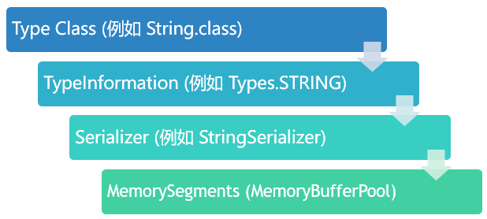

我们知道，泛型在实现中一般有两种方式：
  * 代码共享：也就是对同一个原始类型下的泛型类型只生成同一份目标代码，此时就会出现类型擦除。比如Java中就采取了这种方式，它对List类型，不管
  是List<String>，还是List<Integer>都只生成List.class这一份字节码;

  * 代码特化：也就是对每一个泛型类型都生成不同的目标代码，如果是这种实现就不会出现类型擦除的问题，但是很明显的会出现代码膨胀的问题，C++就是
  采取的这种方式;

Java泛型所使用的类型擦除虽然避免了代码膨胀的问题，节约了JVM的资源，但是却加重了编译器的工作量，使它不得不在运行期之前就进行类型检查，禁止模
糊的或是不合法的泛型使用方式。当然了，在使用extends和super来对将来指向容器的参数类型做限制时，Java的类型擦除也会根据限制的最左侧的界限来
进行擦除和替换。

在简介完Java中的泛型类型擦除后，再来分析Flink中的类型及类型暗示。如下图所示时Flink支持的各种类型：

上图的各种类型的继承关系如下，它们是一一对应的关系：

TypeInformation类是Flink类型系统的公共基类，由于Flink中的类型信息会随着作业的提交而被传递到各个执行节点，所以它及它的所有子类都必须是可
序列化的。在处理数据类型和序列化时，Flink会按照自带的类型描述，一般类型提取和类型序列化框架的顺序进行处理。它会尝试推断出在分布式计算过程中
被交换和存储的数据类型的信息，实现方式是通过TypeExtractor类利用方法签名、子类继承信息等方式，自动提取和恢复类型信息，其提供了对map、flatmap、
fold、mapPartition、AggregateFunction等多个方法获取其返回类型或累加类型的函数。

如果Flink成功推断出了类型信息，就能够非常便捷的完成很多事情，如：
  * 使用POJO类型时，通过引用它们的字段名称对数据进行分组、连接、聚合等操作(如我们常用到的dataStream.keyBy("id")就用到了类型推断)，并提前
  对类型进行检测，以判断拼写错误或类型是否兼容等;

  * 由于Flink所需要处理的数据需要进行网络传输和存储在内存中，数据类型信息越多，序列化和内存存储就越紧凑，压缩效率就越高;

  * 使得用户可以尽量少的关心序列化框架和类型的注册;

最常见的需要用户进行数据类型处理的场景有以下几个：
  * 注册子类型：如果函数只描述了父类型，但是执行时实际上却是子类型，此时一方面Flink需要识别这些子类型可能会造成性能下降，另一方面子类型的某些
  独特的特性可能无法识别，此时就需要通过StreamExecutionEnvironment或者ExecutionEnvironment调用其registerType(clazz)方法来注册子类型;

  * 注册自定义序列化器：Flink会将自己不能处理的类型转交给Kryo序列化器，但是也并不是所有的类型都会被Kryo完美的处理，也就是说Flink并不能处理
  所有的类型，此时就需要为出问题的数据类型注册额外的序列化类，具体做法是在StreamExecutionEnvironment或者ExecutionEnvironment调用
  getConfig().addDefaultKryoSerializer(clazz, serializer)来实现。当然啦，也可以强制使用Avro序列化器来代替Kryo，实现办法是通过
  StreamExecutionEnvironment或者ExecutionEnvironment调用其getConfig().enableForceAvro();

  * 类型提示：尽管FLink提供的推断方法已经很多，但是由于上面介绍的的Java泛型类型擦除，自动提取类型的方式仍然并不总是有效，如果Flink尝试了
  前述的各种办法仍然无法推断出泛型，用户就必须通过TypeHint来辅助进行推断，通过调用returns()方法声明返回类型。returns()方法接受三种类型的
  参数：字符串描述的类名(如"String")、用于泛型类型的参数TypeHint、Java原生Class(例如String.class)等;

  * 手动创建TypeInformation：Flink提供的TypeInformation及其子类已经包含了很多常用类型的信息，但有时可能还是不够，所以手动创建有时是必须的，
  如果是非泛型数据类型，直接通过传递Class对象到TypeInformation.of()即可，否则可能需要TypeHint匿名内部类来捕获泛型类型的信息然后通过
  TypeInformation.of(new TypeHint<XXX>(){})来保存该信息，在运行时TypeExtractor即可通过getGenericSuperclass().getActualTypeArguments()
  方法来获取保存的实际类型;

从类型信息到内存块，需要经历以下步骤，这样数据才能被内存进行有效的管理，这也是Flink类型信息产生作用的过程：
