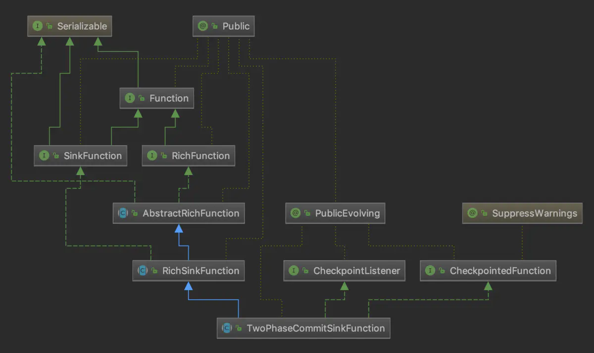
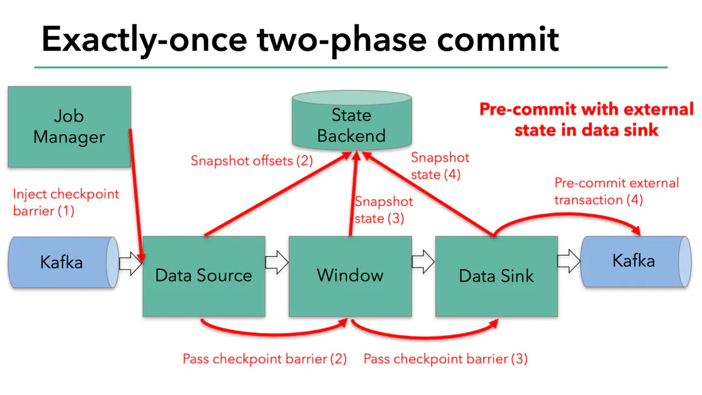
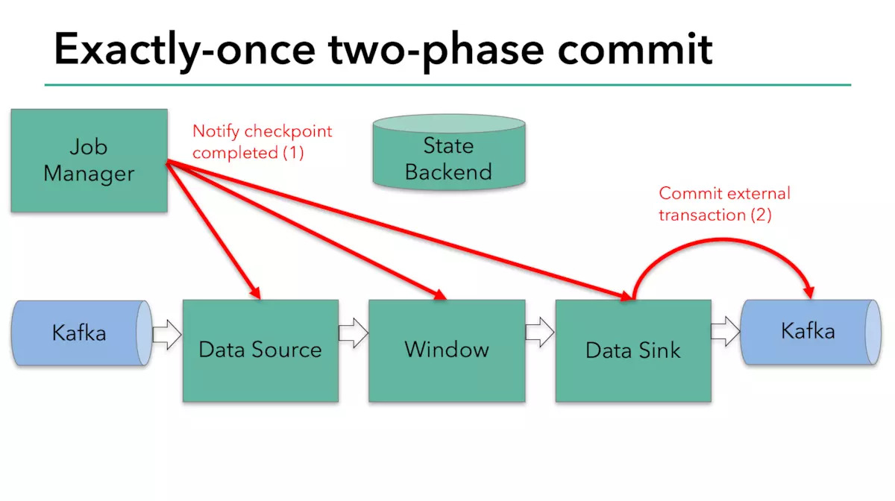

两阶段提交(2PC)是最基础的分布式一致性协议，Flink主要用它来实现exactly once，完成事务性写入。

首先，我们必须知道，在分布式环境中，为了让每个节点都能感知其它节点上事务的执行情况，需要引入一个中心节点来统一协调处理所有节点的执行逻辑，这
个中心节点就叫做协调者，而其它被中心节点协调的节点就是参与者。

而两阶段提交，故名思义，就是将分布式事务划分成了两个阶段，分别是提交请求(表决)阶段和提交(执行正常或异常)阶段。其中，协调者会根据参与者对第一
阶段，也就是提交请求/表决阶段的相应来决定是否真正的执行事务，也就是第二步执行提交/执行正常阶段或是执行提交/执行异常阶段。

下面分别对这两个阶段进行介绍。

第一阶段，提交请求(表决)阶段：
  * 协调者向所有参与者发送prepare请求与事务内容，询问是否可以准备事务的提交，并等待参与者的相应;

  * 参与者执行事务中包含的操作，并记录用于回滚的undo日志和用于重放的redo日志，但是并不真正的执行提交;

  * 参与者向协调者返回事务操作的执行结果，执行成功返回yes，否则返回no;

第二阶段，提交(执行)阶段分为正常和异常两种情况：
  * 如果所有的参与者都返回yes表示事务可以被提交：协调者向所有的参与者发送提交请求，参与者收到协调者发送的提交请求后，真正的进行事务的提交操作，
  并释放其占用的事务资源，向协调者返回确认信息，协调者收到所有的参与者返回的确认信息，分布式事务成功完成;

  * 如果有参与者返回no或者是超时未返回，说明事务中断，需要回滚：协调者向所有参与者发送回滚请求，参与者收到回滚请求后，根据undo日志回滚到事务执行
  前的状态，释放占用的事务资源，并向协调者返回ack，协调者收到所有参与者的ack信息，事务回滚完成;

从上面的介绍可以看出，2PC的实现非常简单，当然也存在一定的缺陷：
  * 协调者存在单点故障，如果协调者宕机，则整个2PC逻辑就完全不能运行;

  * 整个执行过程完全同步，参与者在等待其它参与者响应时都处于阻塞状态，高并发场景下存在性能问题;

  * 依然可能存在不一致的风险，比如如果在第二阶段由于网络或其它原因，只有部分参与者收到了commit请求，此时就会造成部分参与者进行了事务的提交而其它
  参与者未提交的情况;

Flink作为一款时下最火爆的流式处理引擎，能够提供exactly once的语义保证，仅仅flink内部是精确一次的实际上没有多大的意义，因此人们提出的端到端的
exactly once语义保证，即输入、处理程序、输出这个三个部分协同作用，共同实现整个流程的精确一次语义。端到端的exactly once的实现需要数据的输入、
处理和输出都能支持exactly once。在大数据实时处理领域，使用最多的数据输入端应该是kafka了，因此它也需要支持端到端的精确一致语义，在kafka 0.11
版本之前，其实它是不支持的，此时就只能通过at least once语义配合下游的消息幂等处理来间接实现exactly once，但是此时由于需要下游的支持所以存在
一定的局限性，从0.11版本开始，kafka通过为每一个partition维护一个单调递增的sequence number，从而为每一批消息都生成一个序列号，通过这个序列号
来过滤重复的消息，从而实现数据的写入幂等，同时它又通过引入Transaction Coordinator来支持了事务。对于处理程序来说，Flink内部是通过检查点机
制(checkpoint)和分布式快照来实现exactly once的。同时，在Flink中提供了基于2PC的SinkFunction，叫做TwoPhaseCommitSinkFunction来对输入
端的事务性写入提供基础性的支持，这是个抽象类，所有需要保证exactly once的Sink逻辑都需要继承这个类。

TwoPhaseCommitSinkFunction类的继承体系如下图所示。

其中有四个抽象方法与2pc的过程相关，分别是：
  * beginTransaction():开始一个事务，返回事务信息的句柄;

  * preCommit():预提交阶段(提交请求)的逻辑;

  * commit():正式提交阶段的逻辑;

  * abort():取消事务;

由此可见，输出端也必须能对事务性写入提供支持，当然如果输出sink也是kafka 0.11及以上版本肯定是没问题的，如果是其它的输出端也需要其支持事务或
实现了写入的幂等才行。以kafka来看，在FlinkKafkaProducer011类中实现了beginTransaction()方法。当要求支持exactly once语义时，每次都会
调用createTransactionalProducer()来生成包含事务ID的producer。而preCommit()方法的实现就很简单了，就是直接调用了producer的flush()方法。

下图是官方给出的两阶段提交中的提交请求阶段的解释图：

从图中可以看到，每次进行checkpoint时，JM会在数据流中插入一个barrier，这个barrier会随着DAG图向下游传递，每经过一个算子都会触发checkpoint将
状态快照写入状态后端，当这个barrier到达kafka sink时，通过KafkaProducer.flush()方法将数据刷写到磁盘，但是此时还未真正提交。

FlinkKafkaProducer011类中的commit()方法的实现也是调用了KafkaProducer的commitTransaction()方法来向Kafka提交事务。这个方法是在
TwoPhaseCommitSinkFunction类中的notifyCheckpointComplete()方法和recoverAndCommit()中被调用的，也就是它会在本次checkpoint涉及到的
所有的检查点都完成后或是在失败恢复时被调用。

下图是官方给出的两阶段提交中的提交阶段的解释图：

由此可见，只有在所有的检查点都已经成功完成的情况下，写入checkpoint才会成功。对比两阶段提交的理论，可知这也符合两阶段提交的流程。其中，JM作为了
协调者的角色，而各个operator作为了参与者的角色(虽然只有sink这个参与者会真正执行提交)。如果有检查点失败，则分布式快照无法完成，如果最终重试也失败
则会调用abort()回滚事务。

以上，也解释了为何kafka中，对于事务性的producer不需要调用flush()函数，这是因为事务producer在提交事务之前，会将缓冲的数据flush到磁盘，这样
就可以确保那些在开启事务之前发送的消息能在该事务被提交之前完成。